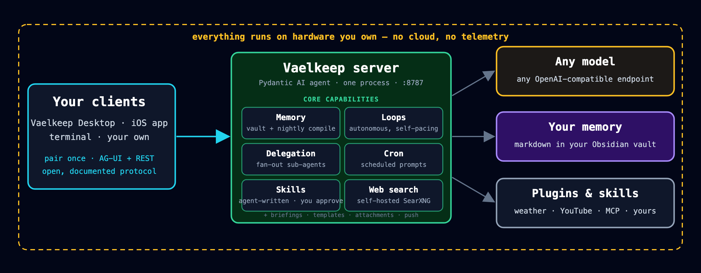
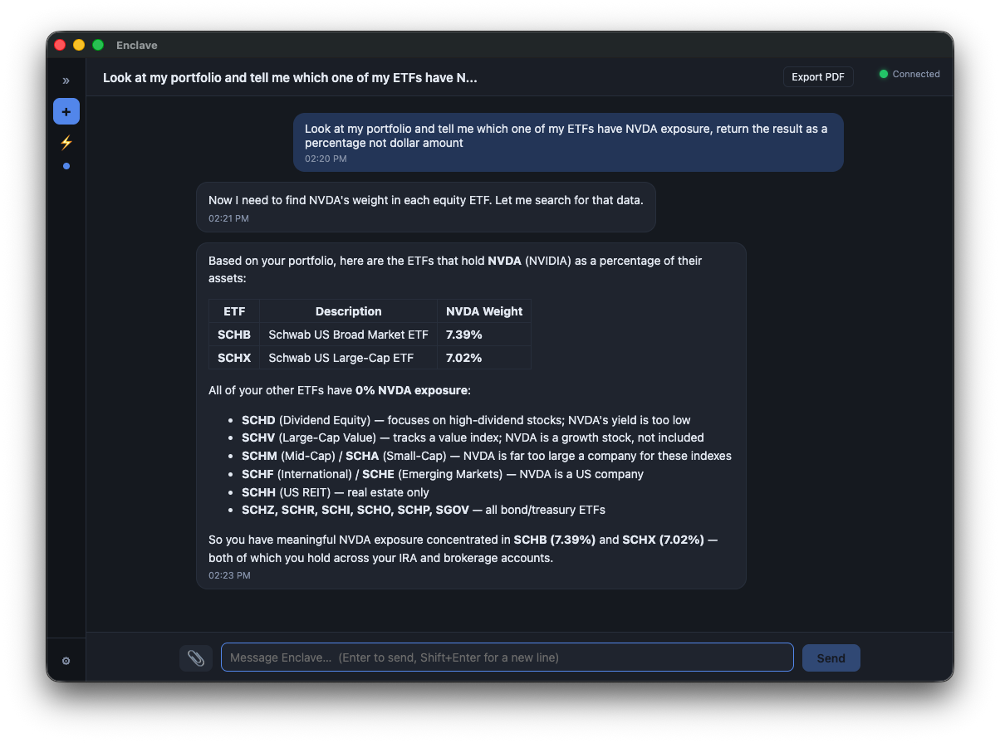
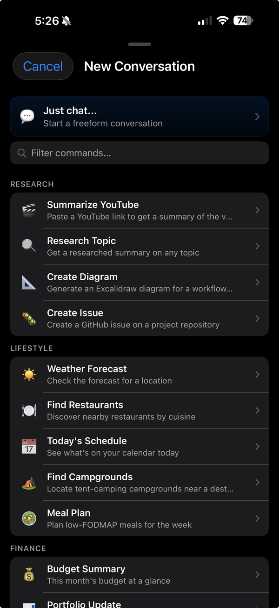
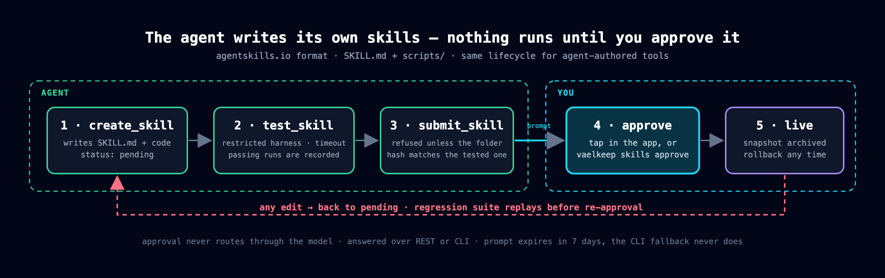
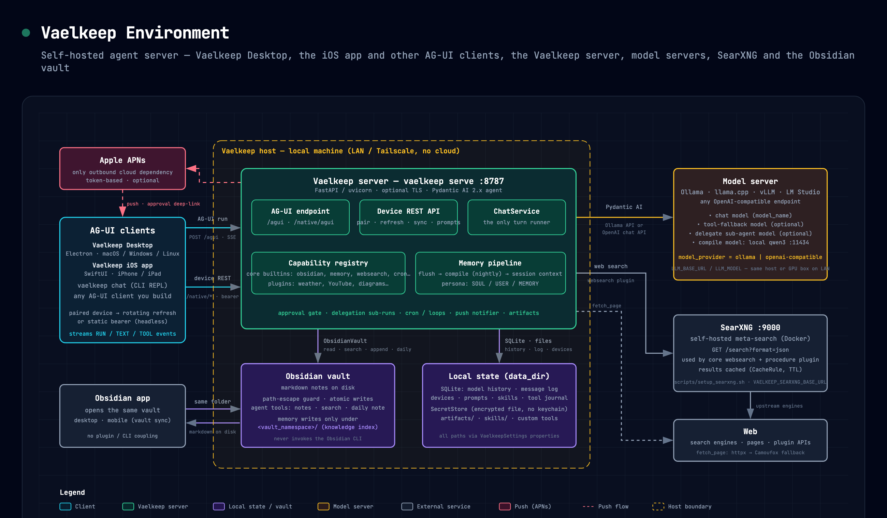

# Vaelkeep

**A self-hosted AI agent server with a native-app protocol and a human trust gate for self-extension.** Everything runs on hardware you own — any OpenAI-compatible model, memory as plain markdown in your Obsidian vault, no cloud, no telemetry.

| Component | Repo | What it is |
|---|---|---|
| **Server** | [`server`](https://github.com/vaelkeep/server) | The agent: Pydantic AI core, capability registry, memory pipeline, web search, loops / delegation / cron, skills with an approval gate, AG-UI + REST device protocol |
| **Desktop** | [`desktop`](https://github.com/vaelkeep/desktop) | Electron client for macOS, Windows, and Linux |
| **iOS** | *coming soon* | SwiftUI client for iPhone and iPad |
| **Capabilities** | [`capabilities`](https://github.com/vaelkeep/capabilities) | Optional plugins: weather, YouTube, diagrams, GitHub, code repos, Apple integrations, budgets, travel |

## An app, not a bot

Vaelkeep doesn't live inside Telegram or Slack. Clients pair with your server once and speak an open, documented protocol — [AG-UI](https://docs.ag-ui.com) streaming for turns, REST for pairing, rotating refresh tokens, cross-device sync, push, and approval prompts.

<table align="center"><tr>
<td width="76%" valign="top"></td>
<td width="24%" valign="top"></td>
</tr></table>

Vaelkeep Desktop and the Vaelkeep iOS app (coming soon), both paired to one server.

## Self-extension you approve

The agent writes its own skills in the open [agentskills.io](https://agentskills.io) format — but nothing runs unrestricted until it has passed a recorded test, been submitted under a content hash, and been approved by you, out of band, never through the model.

## What runs where

Everything inside the dashed boundary runs on one machine. Only Apple push (optional) leaves it.

## Start here

1. **Run the server** — [`server` → Getting Started](https://github.com/vaelkeep/server#-getting-started). Python 3.12+, `uv`, and a model endpoint that calls tools reliably (~20B+ on Ollama, or any OpenAI-compatible server).
2. **Pair the desktop app** — install [Vaelkeep Desktop](https://github.com/vaelkeep/desktop), run `vaelkeep pair --host <reachable-host>` on the server, and enter the 6-digit pairing code in the app.
3. **Add plugins** — `uv add "vaelkeep-capabilities[all] @ git+https://github.com/vaelkeep/capabilities"`.
4. **Build your own client** — [`docs/client-guide.md`](https://github.com/vaelkeep/server/blob/main/docs/client-guide.md) is written so you can hand it to a coding agent and get a working client back.

## How is this different?

Self-hosted agents with memory and skills are no longer rare. Vaelkeep's choices: **an app, not a bot** (owned clients over an open protocol instead of messaging gateways); **self-extension you approve**; **memory you can open in Obsidian**; and a **small, typed core** tuned for local models. Full comparison in the [server README](https://github.com/vaelkeep/server#-how-is-this-different).

---

Built by [Rod Moore](https://github.com/rmoore2112) at **CoreAutomation LLC** · MIT licensed
